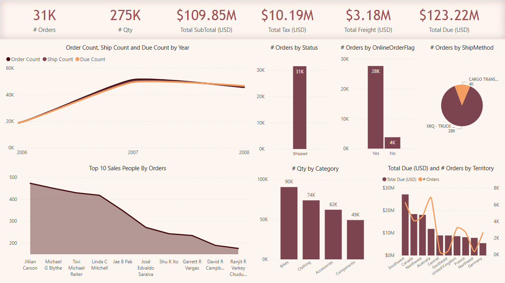
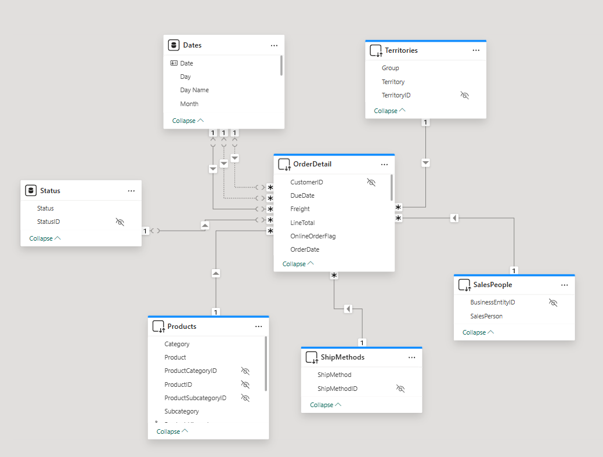

# Sales-Analysis-Dashboard-PowerBI

This project is an **interactive sales dashboard** developed using Power BI as part of my training at the **Information Technology Institute (ITI)**.  
It provides key insights into the sales performance, shipping efficiency, and revenue distribution.

---

## 📊 Dashboard Highlights

The report includes:

- ✅ **Total Orders and Quantities**
- ✅ **Yearly Trends and Shipping Methods**
- ✅ **Top-Performing Salespeople**
- ✅ **Revenue Distribution by Region**

---

## 🔍 Key Metrics

| Metric         | Description |
|----------------|-------------|
| **# Orders**   | Total number of unique customer orders |
| **Count Ship** | Number of orders shipped (based on Ship Date) |
| **Count Due**  | Orders that have a due date – useful for tracking pending payments |
| **Total Due**  | Total amount due for all orders |
| **Tax, Freight** | Breakdown of additional financial charges |

---

## 🛠 Skills Applied

- **Power BI**: Data Cleaning, Data Modeling, and DAX
- **KPI Design**: Creating meaningful business indicators
- **Data Visualization**: Building clear and interactive reports
- **Data Storytelling**: Transforming raw data into business insights

---

## 📷 Screenshots

### 🔹 Dashboard Overview

### 🔹 Detailed Report View

### 🔹 Data Model in Power BI

---

## ▶️ How to Use

1. Download the file: `Sales_Dashboard.pbix`
2. Open it using [Power BI Desktop](https://powerbi.microsoft.com/)
3. Explore the visualizations and DAX measures used

---

## 📁 Project Structure

📦 Sales-Analysis-Dashboard
┣ 📂 images
┃ ┗ 📷 dashboard-overview.png
┣ 📄 Sales_Dashboard.pbix
┣ 📄 README.md

---

## 🙋‍♂️ About Me

I’m currently building my skills in data analysis and Power BI, aiming to become a professional Data Analyst.  
This project is one step in my journey — and many more dashboards and data stories are on the way, God willing.

---

## 🔗 Connect with Me

- [LinkedIn](https://www.linkedin.com/in/mohammed-saeed-4148b423b/)
- [GitHub](https://github.com/Mohamedsaeed12-5)
